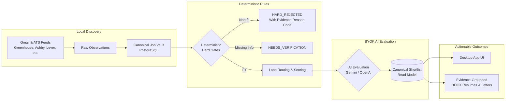

# Job Decision Engine

[](https://github.com/elenaokhonko-eng/Job-Decision-Engine/actions/workflows/ci.yml)
[](LICENSE)
[](https://signpath.org)

**Job Decision Engine** is a local-first, open-source standalone desktop application and decision pipeline designed for **independent builders, engineers, and neurodivergent / AuDHD job seekers**.

Job searching often presents overwhelming cognitive fatigue, rejection trauma from automated black-box ATS filters, and opaque applicant ranking. Job Decision Engine reverses this dynamic: it gives you an auditable, private personal decision engine where **you** filter the jobs deterministically, keep *unknowns* visible without penalties, run bounded AI evaluations using your own keys, and generate tailored CVs grounded strictly in factual career evidence.

---

## Intended Audience & Purpose

- **Independent Builders & Engineers**: Who want a verifiable, scriptable pipeline to scan job opportunities across targeted lanes, preserve full provenance, and eliminate repetitive application overhead.
- **Neurodivergent & AuDHD Users**: Who need a calm, predictable system with low cognitive load, deterministic rules, transparent explanations, and zero risk that operational glitches or missing data become demoralizing "career rejections".
- **Privacy-Conscious Professionals**: Who refuse to upload their career history, resumes, and search habits to third-party SaaS job platforms or closed recruitment aggregators.

---

## Core Capabilities & Behavior Guarantees

1. **Local-First & Private**: Runs as a standalone desktop app on your machine. Your job vault lives in your private [Neon PostgreSQL](https://neon.tech) database. No central telemetry, tracking, or intermediary SaaS servers exist.
2. **Deterministic Hard Gates Before AI**: Hard constraints (location restrictions, remote vs office days, employment type, compensation minimums) are checked locally by deterministic code *before* any LLM evaluation. Non-fits are filtered out without incurring AI costs or hallucinated justifications.
3. **Operational Failures Are Never Career Rejections**: Parser timeouts, network hiccups, schema mismatches, or API rate limits transition to `RETRY_WAIT` and `NEEDS_MANUAL_REVIEW`. They never become `HARD_REJECTED`.
4. **Unknowns Stay Explicit**: Missing workability facts produce `NEEDS_VERIFICATION`, never fabricated assumptions.
5. **Multi-Lane Strategic Discovery**: Discovers broadly across four strategic lanes:
   - `CORE_AI_DATA`
   - `LEGAL_REGTECH`
   - `HEALTH_BIO_PHARMA`
   - `INVESTMENT_MARKETS_FINTECH`
6. **Bring Your Own Keys (BYOK)**: Connect your own Google Gemini or OpenAI API keys. Generative AI evaluation runs automatically as part of the bounded E2E pipeline after deterministic gates pass.
7. **Factual Evidence-Grounded Documents**: Automatically generates customized DOCX resumes and cover letters mapped strictly to your factual career ledger. Zero hallucinations.

---

## Architecture Flow



---

## Download & Windows Code Signing

Official Windows desktop installers are published on our GitHub Releases page:

👉 **[Download Latest Windows Release](https://github.com/elenaokhonko-eng/Job-Decision-Engine/releases)**

### Verified Publisher Notice (SignPath Foundation)

Free code signing for Windows desktop releases is provided by the **[SignPath Foundation](https://signpath.org)**.

```
Verified Publisher: SignPath Foundation
```

When downloading and launching the installer on Windows:
- Windows SmartScreen and the User Account Control (UAC) dialog will display **SignPath Foundation** as the verified publisher.
- Because the SignPath Foundation sponsors the code signing certificate for this open-source project, their name appears on the certificate.
- All release binaries are compiled strictly on ephemeral GitHub-hosted runners directly from clean Git tags, submitted via SignPath's trusted build integration, and approved by project maintainers through hardware-backed HSM signing.

For detailed information on our release governance, roles, and signature verification, see:
- [Code Signing Policy](CODE_SIGNING_POLICY.md)
- [Privacy Policy](PRIVACY.md)
- [Security Policy](SECURITY.md)
- [Third-Party Open Source Notices](THIRD_PARTY_NOTICES.md)

---

## Distribution Modes & Getting Started

Job Decision Engine supports two distribution modes:

### Mode 1: Non-technical Users (Desktop Installer)
1. Download `Job-Decision-Engine-Setup-*.exe` from [Releases](https://github.com/elenaokhonko-eng/Job-Decision-Engine/releases).
2. Install and launch the application.
3. Complete the interactive **Setup Wizard**:
   - Paste your private Neon PostgreSQL connection string.
   - Enter your personal Google Gemini or OpenAI API key.
   - Select your preferred model preset.
   - Click **Initialize Database & Run Migrations** (all 46 migrations install automatically into your database).
4. No Node.js, terminal, or server configuration required!

### Mode 2: Technical Users & Developers (Local Clone)
1. Clone the repository and install dependencies:
   ```bash
   git clone https://github.com/elenaokhonko-eng/Job-Decision-Engine.git
   cd Job-Decision-Engine
   npm ci
   ```
2. Configure your environment:
   ```bash
   cp .env.example .env.local
   # Edit .env.local with your DATABASE_URL, GEMINI_API_KEY, etc.
   ```
3. Run migrations and initialize spaces:
   ```bash
   npm run migrate
   npm run embeddings:registry:init
   ```
4. Run the desktop app in development:
   ```bash
   npm run desktop:dev
   ```

See [Quickstart Guide](docs/quickstart.md) for complete instructions.

---

## Verification & Testing

Job Decision Engine maintains high verification standards across all stages:

```bash
# Type check
npx tsc --noEmit

# Unit & integration test suite (275+ tests)
npm test

# Desktop packaging & security checks (56 checks)
npm run desktop:verify

# Standalone desktop E2E gate check
npm run desktop:e2e-gate
```

---

## Open Source Governance & Policies

- **License**: [MIT License](LICENSE) (100% OSI-approved, no proprietary or dual-licensed code)
- **Privacy Policy**: [PRIVACY.md](PRIVACY.md)
- **Code Signing Policy**: [CODE_SIGNING_POLICY.md](CODE_SIGNING_POLICY.md)
- **Security Policy**: [SECURITY.md](SECURITY.md)
- **Third-Party Notices**: [THIRD_PARTY_NOTICES.md](THIRD_PARTY_NOTICES.md)
- **Contributing Guidelines**: [CONTRIBUTING.md](CONTRIBUTING.md)
- **Code of Conduct**: [CODE_OF_CONDUCT.md](CODE_OF_CONDUCT.md)
