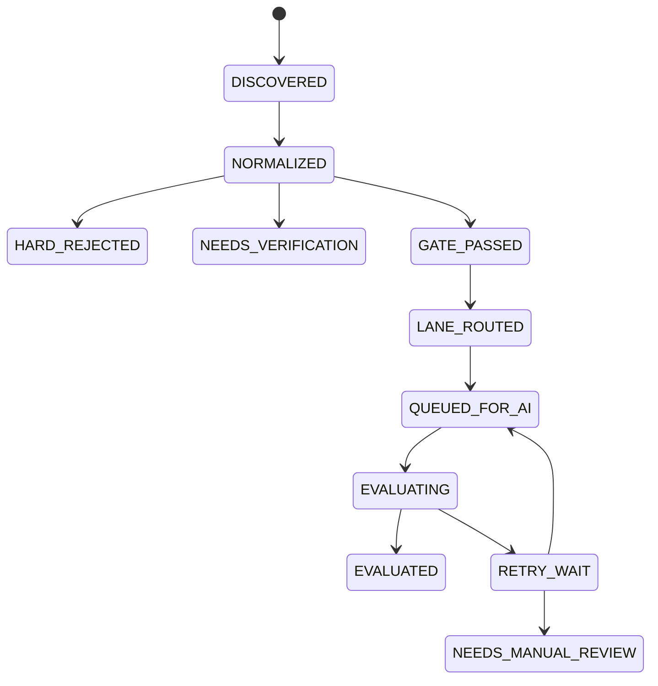

# Architecture

## Pipeline

High-level flow (non-engineer friendly):

```mermaid
flowchart TD
  A[Job sources\n(Gmail alerts, job boards, ATS feeds, manual import)] --> B[Raw observations\n(raw_job_observations)]
  B --> C[Canonical jobs + versions\n(canonical_jobs, job_versions)]
  C --> D[Deterministic hard gates\nPASS / NEEDS_VERIFICATION / HARD_REJECTED]
  D --> E[Semantic lane routing\n(CORE_AI_DATA, LEGAL_REGTECH,\nHEALTH_BIO_PHARMA, INVESTMENT_MARKETS_FINTECH)]
  E --> F[Requirements extraction + deterministic matching]
  F --> G[AI evaluation queue\n(retry-safe; never a career rejection)]
  G --> H[Shortlist read model\n(v_canonical_shortlist)]
  H --> I[Streamlit console + document generators]
```

## State Conservation

Operational failures never become career rejection states. Recoverable evaluation failures enter `RETRY_WAIT`; exhausted attempts enter `NEEDS_MANUAL_REVIEW`.



## Identity

Every observation keeps source identity and raw payload evidence. Canonical jobs may have multiple immutable `job_versions`. Gates, queue rows, evaluations, shortlist rows, and documents are pinned to `job_version_id`.

## Four Lanes

- `CORE_AI_DATA`
- `LEGAL_REGTECH`
- `HEALTH_BIO_PHARMA`
- `INVESTMENT_MARKETS_FINTECH`

## Source Plugins (Compliance)

Public connectors are described by versioned source plugin manifests under `config/source-plugins/`. Each raw observation can link to the active immutable source plugin revision, enabling later compliance/audit reporting.
